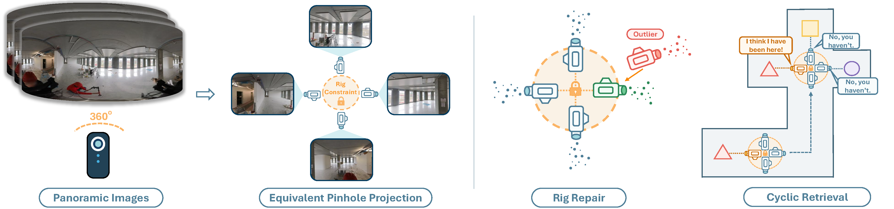

<div align="center">


<h1> RIGOR: Rig-Informed Geometry for Omnidirectional Reconstruction </h1>
<p> Tingjun Huang, Dmitry Rudshin, Mathieu Meyer, Pietro Bonazzi, Marc Pollefeys, Emilia Szymańska </p>

[](https://tangenth.github.io/RIGOR-project-page/)
[](https://arxiv.org/abs/2609.13504)

[Installation](#installation) · [Reconstruction](#reconstruction) · [Evaluation](#evaluation) · [Reproducibility](docs/REPRODUCIBILITY.md)

**Long-sequence reconstruction from gravity-aligned panoramas with a frozen perspective backbone.**



</div>

RIGOR treats four perspective views from each panorama as a virtual rig with a
shared optical center and known relative orientations. Rig consistency supports
local pose/pointmap repair and cyclic capture-level loop retrieval, followed by
joint geometric verification and Sim(3) graph optimization. All learned weights
remain frozen.

## Installation

The reconstruction pipeline requires Linux, Conda, and a CUDA-capable NVIDIA
GPU. One 24 GB GPU is sufficient for the tested configuration. Multiple GPUs
can process independent runs; a single run does not use DDP or pool GPU memory.
The tested software stack uses PyTorch 2.7.1 with CUDA 12.8 wheels. See the
[environment guide](docs/REPRODUCIBILITY.md) for driver and hardware checks.

```bash
./setup_external_repos.sh
PYTORCH_CUDA=12.8 ./setup_hilti_conda_envs.sh
./download_hilti_weights.sh --prefetch-hf
cp hilti_paths.template.yaml hilti_paths.local.yaml
# Edit hilti_paths.local.yaml for your data and output directories.
conda run -n da3 python tools/reproducibility/preflight.py --hash-weights
```

DA3, DA3-Streaming, SALAD inference, and the masking runtime are included.
The setup scripts fetch the pinned public PanoVGGT dependency and model weights.
Third-party code and model terms are listed in [THIRD_PARTY.md](THIRD_PARTY.md).

## Data

Obtain panoramic sequences and reference trajectories from the
[official Hilti–Trimble–Oxford challenge](https://github.com/Hilti-Research/hilti-trimble-slam-challenge-2026).
The [run manifest](tools/hilti_workflow/manifests/hilti_all_runs.json) lists the
30 benchmark identities. Keep datasets, weights, and generated outputs outside
the source tree. The dense LiDAR reference clouds and ROI annotations used for
geometry evaluation are **not distributed** by this repository.

## Reconstruction

Run RIGOR on one ROS2 bag using the visible GPU:

```bash
CUDA_VISIBLE_DEVICES=0 conda run -n da3 python tools/hilti_workflow/run_method.py da3 \
  --floor floor_1 --date 2025-05-05 --run 1 \
  --rosbag /path/to/rosbag.db3 \
  --output-root /path/to/outputs \
  --no-delete-rosbag-on-success
```

The default [RIGOR configuration](tools/hilti_workflow/configs/rigor_paper_free_scale.yaml)
uses four 95° views at 90° yaw intervals, 32-image blocks with 16-image overlap,
validated rig repair, cyclic retrieval, and a scale-adjusting graph. GPU count
does not change these settings. Append `--dry-run` to inspect the command first.

The panorama-native sequential comparison is available from prepared leveled
ERP frames and their invalid-pixel masks:

```bash
CUDA_VISIBLE_DEVICES=0 conda run -n da3 python tools/hilti_workflow/run_method.py panovggt \
  --floor floor_1 --date 2025-05-05 --run 1 \
  --output-root /path/to/outputs \
  --panovggt-repo .external/PanoVGGT \
  --checkpoint .external/PanoVGGT/checkpoints/model.pt \
  --image-dir /path/to/levelled_erp \
  --erp-mask-npz /path/to/invalid_erp.npz
```

Results follow one [output convention](docs/OUTPUT_LAYOUT.md):

```text
<output_root>/<method>/<floor>/<date>/run_N/reconstruction/
```

Inputs and reusable work are retained by default. Checkpoints and status logs
support interrupted runs. Batch entrypoints and preprocessing details are in
the [workflow guide](tools/hilti_workflow/README.md).

## Evaluation

The [evaluation guide](tools/hilti_workflow/evaluation/README.md) covers
timestamp-associated trajectory errors, independent point-cloud registration,
ROI geometry metrics, and retrieval evaluation from cached SALAD descriptors.
Ground truth is used only for evaluation. Registration writes separate aligned
artifacts and never overwrites `reconstruction.ply`.

```bash
conda run -n da3 python -m pytest -q tools/hilti_workflow
conda run -n da3 python -m pytest -q da3_streaming/loop_utils/tests
```

See [reproducibility](docs/REPRODUCIBILITY.md) for configuration provenance,
the repair ablation, and the scope of supported reproduction. The
[baseline guide](tools/hilti_workflow/BASELINES.md) provides the DA3-Legacy
preset and the exact cache-based DA3-Sequential construction.

## Repository structure

```text
src/depth_anything_3/     Frozen perspective backbone
da3_streaming/           Block reconstruction, rig repair, retrieval, and graph
tools/hilti_workflow/    Preprocessing, method runners, and evaluation
tools/reproducibility/  Environment and asset checks
assets/                 Paper illustrations
docs/                   Reproduction and output guides
```

## Citation 
If you find this dataset useful, please consider giving it a ⭐ and citing it in your work.
```bibtex
@misc{huang2026rigor,
      title={RIGOR: Rig-Informed Geometry for Omnidirectional Reconstruction}, 
      author={Tingjun Huang and Dmitry Rudshin and Mathieu Meyer and Pietro Bonazzi and Marc Pollefeys and Emilia Szymańska},
      year={2026},
      eprint={2609.13504},
      archivePrefix={arXiv},
      primaryClass={cs.CV},
      url={https://arxiv.org/abs/2609.13504}, 
}
```

## Acknowledgements and license

This implementation builds on Depth Anything 3, DA3-Streaming, SALAD,
Grounded-SAM-2, and PanoVGGT. Source and model licenses remain those of their
respective projects; see [LICENSE](LICENSE) and [THIRD_PARTY.md](THIRD_PARTY.md).
